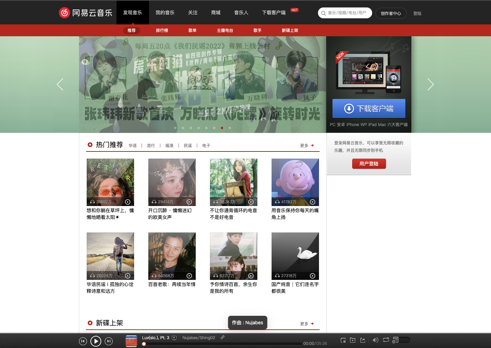

# 仿网易云音乐项目
- 一个简单的学习react的demo项目
- 侧重点更在于搭建一套ts + eslint + prettier + react的项目
## 技术选型
- React v18
- TS
- 构建工具
  - Webpack(react-CRA)
  - SWC代替babel
- 样式：
  - Scss
  - styled-component
- UI
  - ant design for react
> 这个项目只做了首页 + 音乐播放/切换/上下一曲/歌曲播放模式（单曲、连续、随机）...等基础东西
> 
> 不再继续做的原因：
> 1. 这个项目拿的是别人的接口，身为nodejs开发觉得时间浪费在css上挺亏的
> 2. 做这个项目只是为了快速掌握react和redux以及其他的常用库
> 3. 把时间侧重在nodejs微服务等高级应用场景方向
> 
> 完结时间⌚️：2023-01-14
- 项目展示

